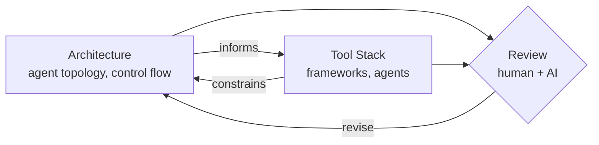

# HomeWork

## Method

This chapter describes *how* this project is built — not *what* it builds. Work proceeds as an iterative design loop with two coupled steps: define the **orchestration architecture**, then bind it to a **tool stack**, then review and repeat.

### Architecture
Goal: Create **agent topology** 
that defines **who talks to whom, in what order**:
- agent roles
- orchestrator vs. workers
- and control flow pattern (sequential, hierarchical, or blackboard). Tool-agnostic.

###  Tool Stack
Goal: Maps the architecture onto **concrete tools** (frameworks, models, platforms) that implement it. An implementation mapping, not a redesign.

### Review
Goal: Design critique of the protocol, not a code review of the output. It may send the process back to Goal 1 before returning to Goal 2.
